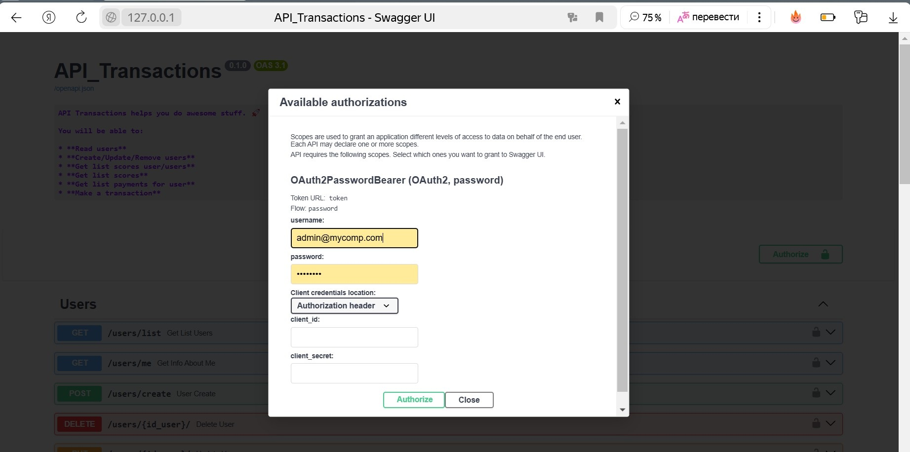
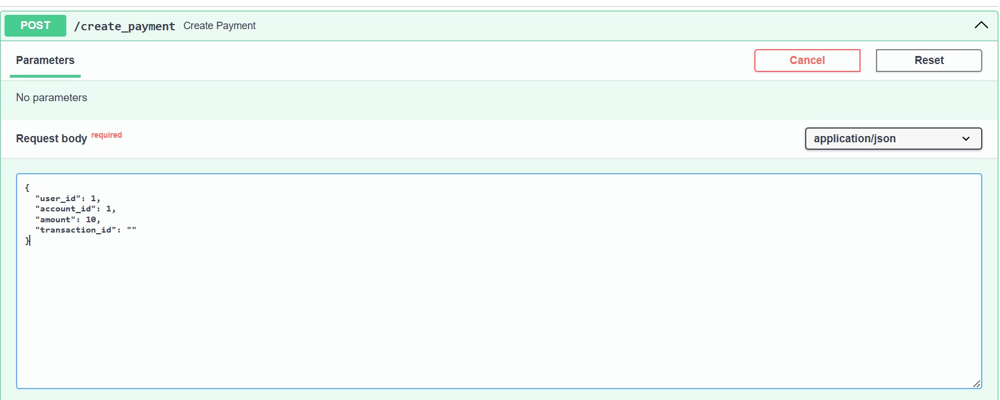

# API для обработки транзакций
### Реализация бэкенд сервиса для обработки транзакция 

Используемые технологии:
- Фреймворк: FastAPI
- База данных: PostgreSQL
- ORM: SQLAlchemy
- Брокер сообщений: RabbitMQ
- Аутентификация: JWT
- Управление миграциями: Alembic
- Тестирование: Pytest
- Web-сервер: Nginx

Реализованный функционал:
- авторизация и аутентификация пользователей с использование JWT
- получение администратором списка пользователей со списком счетов с балансами
- получение пользователем списка своих счетов
- получение пользователем списка своих платежей
- обработка платежа

## Правила использования

Пользователи разделяются  на: администраторов и пользователей.

Администратор может создать/удалить/обновить пользователя, получить список пользователей с их счетами.
Пользователь может получить данные о себе, список своих счетов и балансов, список своих платежей.

## Запуск проекта

Для развертывания проекта используется `Docker Compose`.

Перед запуском проекта необходимо подготовить env-файл:

Чтобы запустить проект используем команду:
```
docker compose up -d
```

При первом запуске проекта необходимо выполнить миграции базы данных с помощью Alembic используя команду:

```
docker compose exec app alembic upgrade head
```
а также создать тестовых пользователей
```
docker compose exec app docker/create_users.sh
```
Утилита создаёт администратора с email: admin@mycomp.com и паролем: 1qaz!QAZ,
а также пользователя с email: user1@mycomp.com и паролем: 2wsx@WSX


Стартовая страница проекта [http://127.0.0.1:80](http://127.0.0.1:80).


Страница с интерактивной документацией [http://127.0.0.1:80/docs](http://127.0.0.1:80/docs).


Перед началом работы необходимо авторизоваться, для чего использутся меню Authorize.



в качестве username используется email пользователя.

Затем можно начать работу с транзакциями. 

Для каждой задачи создан отдельный раздел:
- Users - управление пользователями
- Payments - получение информации о счетах и платежах
- main - создание/проведение платежа, JWT авторизация
- Webhooks - документирование webhook сервиса


Для проверки работы сервиса с помощью эндпоинта `create_payment` создаём тестовую транзакцию
указав user_id пользователя, account_id счета пользователя, amount (сумму) транзакции. 



С помощью эндпоинта `transaction` запускаем сформированную транзакцию, скопировав в тело запроса 
результат предыдущего запроса 


## Тестирование проекта

Для тестирования проекта необходимо создать тестовую базу командой
```
docker compose -f docker-compose-test.yml up -d
```

Перейти в каталог с тестами
```
cd tests
```

Для тестирования раздела работы с пользователями
```
pytest -v test_user.py
```

Для тестирования раздела работы со счетами/платежами
```
pytest -v test_payments.py
```

Для тестирования раздела работы с транзакцией
```
pytest -v test_transaction.py
```

## Licence

Author: Stanislav Rubtsov